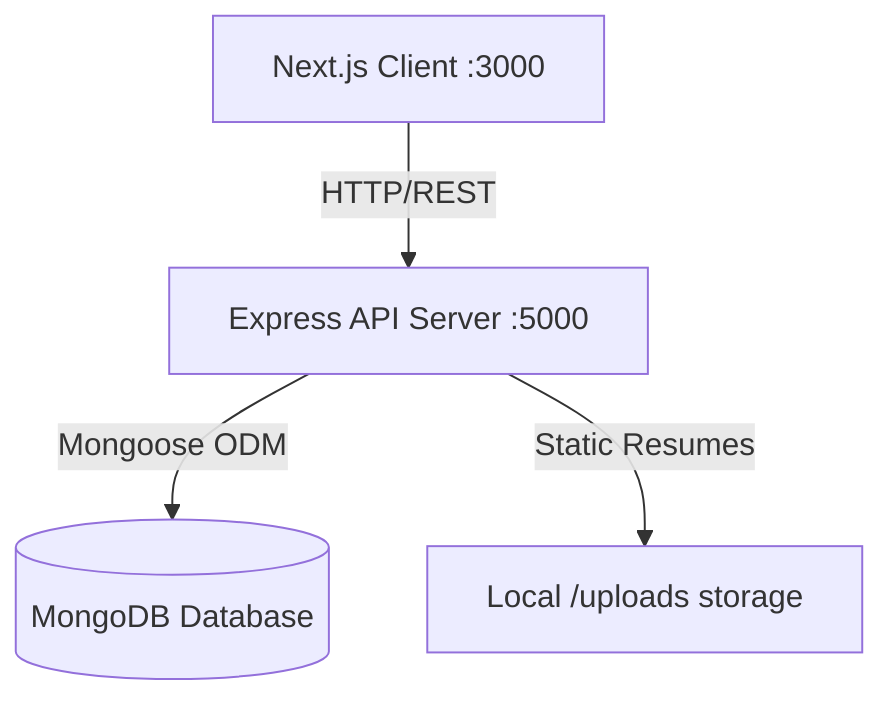

# SoftCode Enterprise Website & API Suite

SoftCode is a modern, premium, enterprise-grade software company website built with a high-performance **Next.js 16** frontend (with TypeScript, Tailwind CSS v4, and Framer Motion) and a secure **Node.js Express** REST API backend powered by **MongoDB**.

---

## Technical Architecture



### Tech Stack Details
* **Frontend**: Next.js (App Router), React 19, TypeScript, Tailwind CSS v4, Framer Motion, next-themes, React Hook Form, Axios.
* **Backend**: Node.js, Express.js (ES Modules), Mongoose, JSON Web Tokens (JWT), BcryptJS, Multer (multipart resume uploads), Helmet, Express Rate Limit.
* **Database**: MongoDB.
* **Infrastructure**: Multi-stage Dockerfiles + Docker Compose orchestration.

---

## Folder Layout

* `/frontend`: Next.js Client application.
* `/backend`: Node.js Express server.
* `/docker-compose.yml`: Local multi-container development orchestration.
* `/package.json`: Main workspace script mappings.

---

## Quick-Start Options

### Option A: Running via Docker (Recommended, Zero Setup)
Make sure you have Docker Desktop active, then run from the root workspace:

```bash
# Build and run MongoDB, Express Backend, and Next.js Frontend
npm run docker:up
```

* **Next.js Client**: served at [http://localhost:3000](http://localhost:3000)
* **Express API Server**: served at [http://localhost:5000](http://localhost:5000)
* **MongoDB Instance**: mapped to localhost:27017

---

### Option B: Local Development Setup

#### 1. Install All Dependencies
From the root workspace, install packages for both frontend and backend subfolders:
```bash
npm run install:all
```

#### 2. Run Database Seeding
Ensure you have a MongoDB instance active locally on `mongodb://localhost:27017/softcode`. Populate initial blog articles, portfolio projects, career positions, and create the default administrator account:
```bash
npm run seed
```

#### 3. Spin Up Development Servers
Open two terminal windows (or run commands in background):

```bash
# Start backend Express API server (runs on port 5000)
npm run dev:backend

# Start frontend Next.js App (runs on port 3000)
npm run dev:frontend
```

---

## Administrative Credentials

Access the administrative dashboard by navigating to [http://localhost:3000/admin](http://localhost:3000/admin).

* **Administrative Username**: `admin`
* **Administrative Email**: `admin@softcode.com`
* **Administrative Password**: `AdminPass123!`

---

## Key Features

1. **Dark & Light Themes**: Powered by Class-based transitions and preserved selection states.
2. **Dynamic Case Studies Filter**: Tab-based layout animations displaying metadata modals and real-time metrics.
3. **Careers Portal**: Displays active postings and includes a `FormData` parser to upload candidate resume files.
4. **Insights Blogging Engine**: Supports slug tracking and markdown formatting.
5. **Rate Limiting & Hardened Security**: Express APIs are guarded using `helmet` headers and rate-limit scopes.

